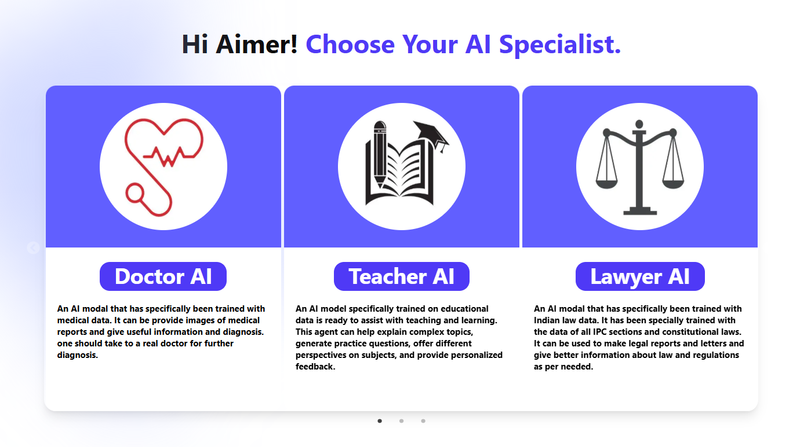

# 🚀 Project Title
AI Specialist at your fingertips

# 📌 Problem Statement
Problem Statement 1- Weave AI magic with Groq

# 🎯 Objective
- Limited availability of specialized experts in many regions.
- Consultations are often expensive and not affordable for all.
- Waiting times slow down critical decision making and actions.
- AI Specialist is designed to offer precise, context-aware responses for professional tasks.

<hr style="border:2px solid #3d444d; margin-top: 2rem;">

## 🧠 Team & Approach
### Team Name: RisingDevelopers
### Team Members: 
- Raunak (https://github.com/ThisIsAimer)
- Akriti (https://github.com/ThisIsAkriti)

## Your Approach:
- Planning and Setup:
   - Defined project scope: AI agents (DoctorAI, TeacherAI, LawyerAI) with text, image, and file processing using Groq API and RAG.
   - Initialized Next.js with TypeScript, installed Tailwind CSS, Shadcn UI, Prisma, and Neon DB. Set up Cloudinary for file storage and Kinde for authentication.
- Authentication:
   - Integrated Kinde for secure user login/signup, configuring API routes and environment variables for session management.
- UI Development:
   - Built responsive UI with Shadcn components and Tailwind CSS, creating reusable components for agent selection, chat, and file uploads.
- AI Agent Integration:
   - Implemented Groq API for text-based agent responses, defining specialized system prompts for each agent (e.g., DoctorAI for medical queries).
   - Used Cloudinary to handle image/file uploads, as Groq API lacks file reading support.
- RAG Implementation:
   - Set up Prisma with Neon DB to store document embeddings for RAG, enabling context-aware responses by retrieving relevant data before generating answers with Groq.
- AI Avatar for Voice:
   - Developed a 3D AI avatar for DoctorAI using Three.js and vrm files for voice input/output, integrating with Groq for response generation.
- Testing and Refinement:
   - Tested agent functionality, file handling, and voice features. Fixed TypeScript errors and optimized API calls for performance.

<hr style="border:2px solid #3d444d ; margin-top: 2rem;">

## 🛠️ Teach Stack
### Core Technologies Used:
- **Frontend**: Next.js, React.js, TypeScript, Tailwind CSS, shadcn/ui, Blender 
- **Backend**: Next.js, Kinde
- **Database**: Neon DB with Prisma (Modern ORM)
- **Apis**: Groq, Cloudinary
- **Hosting**: vercel

## Sponsor Technologies Used:
- **✅ Groq**: 
   - Reading image, text and voice data. Fetching reading and voice data.  
   - Implemented RAG which enhances AI responses with context from a Neon DB, ensuring accurate and relevant answers.

<hr style="border:2px solid #3d444d; margin-top: 2rem;">

## ✨ Key Features
- **✅ Conversation with AI**: Fire up DoctorAI's voice chat to talk with our AI agent in real-time
- **✅ Image and File Reading**: Upload and process images or files to extract relevant information, powered by the Groq API and Cloudinary.
- **✅ Retrieval-Augmented Generation (RAG)**: Enhances AI responses with context from a Neon DB, ensuring accurate and relevant answers.





<hr style="border:2px solid #3d444d; margin-top: 2rem;">

## ✅ Tasks and Bonus Checklist
- ✅ All members of the team completed the mandatory task - Followed at least 2 of our social channels and filled the form (Details in Participant Manual)
- ✅ All members of the team completed Bonus Task 1 - Sharing of Badges and filled the form (2 points) (Details in Participant Manual)
- ✅ All members of the team completed Bonus Task 2 - Signing up for Sprint.dev and filled the form (3 points) (Details in Participant Manual)

# 🧪 How to Run the Project
### Requirements:
- Next.js/React.js/Node.js/Tailwind
- API Keys:
   -  Groq (for AI inference)
   - Cloudinary (for image/file storage)
   - Neon DB (for database hosting)
- **.env file**:
```
   - GROQ_API_KEY=your_groq_api_key
   - KINDE_CLIENT_ID=your_client_id
   - KINDE_CLIENT_SECRET=your_client_secret
   - KINDE_ISSUER_URL=https://your-domain.kinde.com/
   - KINDE_SITE_URL=http://localhost:3000/
   - KINDE_POST_LOGIN_REDIRECT_URL=http://localhost:3000/dashboard
   - KINDE_POST_LOGOUT_REDIRECT_URL=http://localhost:3000/
   - DATABASE_URL=postgresql://neondb_database_url
   - Cloudinary (for image and file uploads)
   - CLOUDINARY_CLOUD_NAME=your_cloud_name
   - CLOUDINARY_API_KEY=your_api_key
   - CLOUDINARY_API_SECRET=your_api_secret
   - CLOUDINARY_UPLOAD_PRESET=your_upload_preset
   - DOCTOR_PROMPT=write_your_syetem_prompt
   - TEACHER_PROMPT=write_your_syetem_prompt
   - ACCOUNTANT_PROMPT=write_your_syetem_prompt
   - PROGRAMMER_PROMPT=write_your_syetem_prompt
   - LAWYER_PROMPT=write_your_syetem_prompt
   - DOCTOR_AVATAR=write_your_syetem_prompt 
```

## Local Setup
      # Clone the Repo
         git clone https://github.com/your-username/ai-specialist.git
     

      # Install Dependencies:
         cd project-name
         npm install
        
      3. Set Up Prisma: Initialize the database schema:
         npx prisma db push
         
      4. Run the Development Server:
         npm run dev

## 🧬  Future Scope
- Adding more helpful ai agents.
- Setting up avatar for each agents(like DoctorAI).
- Improving mesh quality and animations of avatars.

## 📎 Resources/ Credits
- Groq for AI integration.
- Kinde for authentication.
- Cloudinary for image and file processing.
- Prisma and neondb
- Blender for meshes and vrm files
- Tailwind, Threejs, Shadcn, react-slick

# 🏁 Final Words
   - Building this AI agents project was a thrilling journey, blending cutting-edge tech with creative problem-solving. We loved crafting specialized agents like DoctorAI and integrating voice avatars, pushing the boundaries of user interaction. 
   - The challenges—tackling Groq API limitations, fine-tuning RAG, and ensuring seamless authentication—tested our skills but fueled our growth. This hackathon was a rollercoaster of innovation and learning, and we’re proud of the result!

Built with ❤️ by Team RisingDevelopers